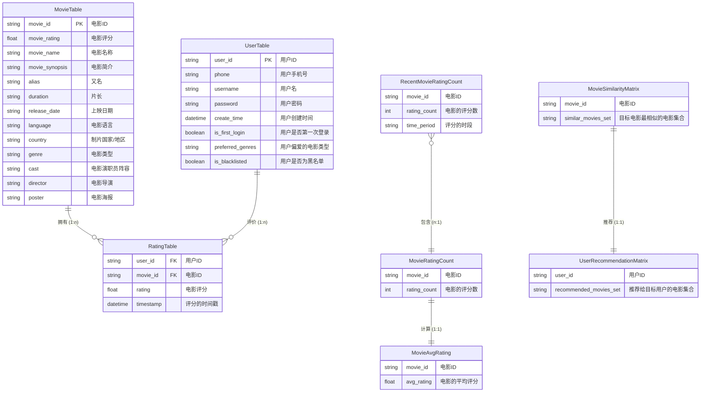

```mermaid
erDiagram
    %% 关系定义
    MovieTable ||--o{ RatingTable : "拥有 (1:n)"
    UserTable ||--o{ RatingTable : "评价 (1:n)"
    RecentMovieRatingCount }o--|| MovieRatingCount : "包含 (n:1)"
    MovieRatingCount ||--|| MovieAvgRating : "计算 (1:1)"
    MovieSimilarityMatrix ||--|| UserRecommendationMatrix : "推荐 (1:1)"

    %% 实体与属性
    MovieTable {
        string movie_id PK "电影ID"
        float movie_rating "电影评分"
        string movie_name "电影名称"
        string movie_synopsis "电影简介"
        string alias "又名"
        string duration "片长"
        string release_date "上映日期"
        string language "电影语言"
        string country "制片国家/地区"
        string genre "电影类型"
        string cast "电影演职员阵容"
        string director "电影导演"
        string poster "电影海报"
    }

    RatingTable {
        string user_id FK "用户ID"
        string movie_id FK "电影ID"
        float rating "电影评分"
        datetime timestamp "评分的时间戳"
    }

    UserTable {
        string user_id PK "用户ID"
        string phone "用户手机号"
        string username "用户名"
        string password "用户密码"
        datetime create_time "用户创建时间"
        boolean is_first_login "用户是否第一次登录"
        string preferred_genres "用户偏爱的电影类型"
        boolean is_blacklisted "用户是否为黑名单"
    }

    RecentMovieRatingCount {
        string movie_id "电影ID"
        int rating_count "电影的评分数"
        string time_period "评分的时段"
    }

    MovieRatingCount {
        string movie_id "电影ID"
        int rating_count "电影的评分数"
    }

    MovieAvgRating {
        string movie_id "电影ID"
        float avg_rating "电影的平均评分"
    }

    MovieSimilarityMatrix {
        string movie_id "电影ID"
        string similar_movies_set "目标电影最相似的电影集合"
    }

    UserRecommendationMatrix {
        string user_id "用户ID"
        string recommended_movies_set "推荐给目标用户的电影集合"
    }
```